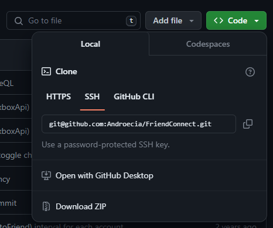
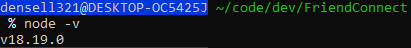
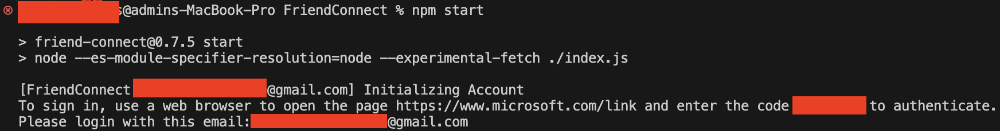
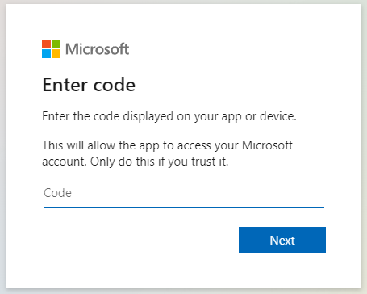
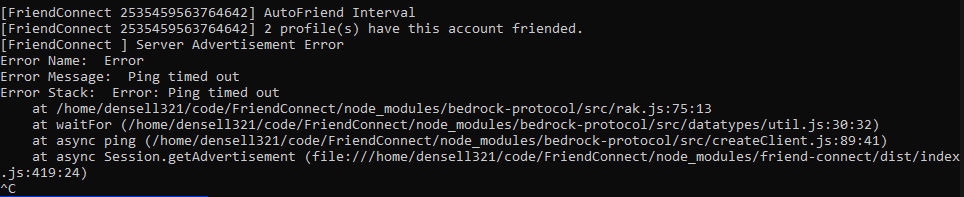

# FriendConnect
## UPDATE

We are working on a rust port to solve the issues that have occurred, please be patient. Thank you
## WARNING

**BEFORE YOU USE THIS TOOL, PLEASE READ THE FOLLOWING:
WE _AS CONTRIBUTORS_ ARE NOT RESPONSIBLE FOR ANY DAMAGE OR LOSS CAUSED BY THIS APP.
USE AN ALT ACCOUNT, JUST IN CASE THERE IS AN ISSUE WITH THIS METHOD.**

## About

This is a project for minecraft bedrock/(java with geyser) that allows you to join servers via the in game friends tab. The most notable differing factor is, that console players can connect to servers without using an advanced method.

This project is still in development, so please be patient if there are issues.

The best way to use this tool at the moment is as a node module. Read the tutorial below for more information of how to set this up.

## Feature Note

This tool includes a lesser known fix that flushes the sessions once it hits 35 players. Another feature is efficient multi account management, this is achieved by having all of the accounts join the same session.


## Discord

If you want to be notified when any changes occur to this project, you can join the discord server.<br>
**_[FriendConnect Support Server Invite](https://discord.gg/tZ4tA2UQKU)_**

## How it works in game

[](https://youtu.be/77qXotN9jGo "A New Realms Replacement, A new method for joining servers on console.")

## How to use it:

If you are using this standalone or via npm you will need to have at least node 18.2 installed with npm.

### Pterodactyl 

If you use Pterodactyl Panel you can refer to
https://github.com/Androecia/FriendConnect-Pterodactyl for the official egg.
You'll still want to read below so you understand what certain variables do and are as informed as possible.

### Standalone

You can download this repository and edit the `.env` file to use this tool standalone. The process is pretty straight forward and only requires a couple of steps to get going.

Step 1: Clone the repo, or download the repos files as a `zip` archive



Unzip the archive and/or navigate to the root directory of the tool.

Step 2: Make sure you are on node version 18



> **Note:** Unless you have downloaded this verson of node. You may need to install `NVM` (node version manager) to setup an alias in you `bashrc` or `zshrc` file to change the version to node 18.

```tty
nvm install 18
nvm use 18
nvm alias default 18
```

Make sure you also install `friend-connect` as an npm package to avoid the issue of `MODULE_NOT_FOUND`

```tty
npm install friend-connect
```

Step 3: Generate an `index.js` file to setup a default Friend-Connect configuration, and place it into the main directory

```js
import { Session } from "friend-connect";

new Session({
	hostName: "Server Name", // The hostname of the server
	worldName: "Message of the Day: Hello World", // Use as a MOTD
	version: "1.19.60", // The version of the session, this can be any string.

	protocol: 565, //The protocol of the server you are connecting to.

	connectedPlayers: 0, // Used as a fallback if pinging the server fails.
	maxConnectedPlayers: 40, // Used as a fallback if pinging the server fails.

	ip: "tailvile.xyz", // The ip of the server you are using.
	port: 19132, // The port of the server you are using.
	connectionType: 6, // I don't recommend changing this.

	log: true, // If you want to see the console output set to true.
	joinability: "joinable_by_friends", // The joinability of the session, if this is changed only one account can be used to connect to the session.
	autoFriending: true, // Set this to true if you want to automatically add people who follow the accounts.
	pingServerForInfo: true, // If FriendConnect keeps erroring out due to a rakNet ping error you can set this to false.

	tokenPath: "./auth", // The path to the directory that contains the authentication tokens.
	accounts: ["foo@example.com", "bar@example.com"], // A list of emails that correspond to accounts you want to use with FriendConnect.

	//These are values retrieved from the server on when the server advertisement is fetched, if true it will use a value from above.
	constants: {
		//worldName: true,
		//hostName: true,
		maxConnectedPlayers: true,
		connectedPlayers: true,
		//protocol: true,
		version: true,
	},
});
```

Step 4: Run the following command in your terminal and include the absolute path for your `index.js` file

```tty
node --es-module-specifier-resolution=node  --experimental-fetch ./path/to/file.js
```

Step 5: If all goes well you should be greeted with this output



Step 6: Navigate to `https://www.microsoft.com/link` and enter the auth code given to you in the output. This will link the xbox live account to the Friend-Connect tool.



Step 7: Output should be relatively normal, assuming you actually have a server running that the program can ping, if not, there will be an error showing that the ping timed out.



If this happens, double check your server IP and ensure your ports are forwarded propely `19132` and `19133`.

Congratulations! You are all set to use the Friend-Connect Tool!

### As an NPM library
```tty
npm install friend-connect
```

Create a file and name it whatever you want.
Then paste this example into it:

```js
import { Session } from "friend-connect";

new Session({
	hostName: "Server Name", // The hostname of the server
	worldName: "Message of the Day: Hello World", // Use as a MOTD
	version: "1.19.60", // The version of the session, this can be any string.

	protocol: 565, //The protocol of the server you are connecting to.

	connectedPlayers: 0, // Used as a fallback if pinging the server fails.
	maxConnectedPlayers: 40, // Used as a fallback if pinging the server fails.

	ip: "tailvile.xyz", // The ip of the server you are using.
	port: 19132, // The port of the server you are using.
	connectionType: 6, // I don't recommend changing this.

	log: true, // If you want to see the console output set to true.
	joinability: "joinable_by_friends", // The joinability of the session, if this is changed only one account can be used to connect to the session.
	autoFriending: true, // Set this to true if you want to automatically add people who follow the accounts.
	pingServerForInfo: true, // If FriendConnect keeps erroring out due to a rakNet ping error you can set this to false.

	tokenPath: "./auth", // The path to the directory that contains the authentication tokens.
	accounts: ["foo@example.com", "bar@example.com"], // A list of emails that correspond to accounts you want to use with FriendConnect.

	//These are values retrieved from the server on when the server advertisement is fetched, if true it will use a value from above.
	constants: {
		//worldName: true,
		//hostName: true,
		maxConnectedPlayers: true,
		connectedPlayers: true,
		//protocol: true,
		version: true,
	},
});
```

Set `type` to `module` in the `package.json` file.
_If you don't know what I am talking about, make a file called `package.json` and add the following._

```json
{ "type": "module" }
```

You can run the file with `node --es-module-specifier-resolution=node  --experimental-fetch ./path/to/file.js`.

### Debug Info

If you want to see extra debug information.
Set this environment variable as seen below.
```ini
FRIEND_CONNECT_DEBUG=true
```

## To Do List

-   [x] Add a way to fetch the version and protocol of the server on session Update.
-   [x] Add automatically querying the player numbers from the server on session Update.
-   [ ] Add the ability to provide an array of strings to be chosen from for the hostName and worldName that is rotated through on session Update.
-   [ ] Check if the user owns any games if so send an error telling them to use an alt account.
    > I was unable to get the games owned, but I do check if there are achievements on the profile.
-   [x] Add an option to disable auto friending.
-   [ ] Make a user friendly way to use this tool like a discord bot or something.
-   [ ] Add a cli tool maybe.

## Testing

If you are contributing to this project, edit the `.env` file in the root directory.
This file is used in `./test/index.js` to test the tool.

```ini
# The hostname of the server
HOSTNAME=FriendConnect
# The world name of the server
WORLD_NAME=Message of the Day: Hello World
# The version of the server
VERSION=1.19.60
# The protocol of the server
PROTOCOL=565
# The connected players of the server
CONNECTED_PLAYERS=0
# The max connected players of the server
MAX_CONNECTED_PLAYERS=40
# The ip of the server
IP=tailvile.xyz
# The port of the server
PORT=19132
# The connection type of the server
CONNECTION_TYPE=6
# If you want to log the server
LOG=false
# The joinability of the server
JOINABILITY=joinable_by_friends
# If you want to auto friend people
AUTO_FRIENDING=true
# If you want to ping the server for info
PING_SERVER_FOR_INFO=true
# The accounts to use separated by a comma
ACCOUNTS=
# The constant world name
CONSTANT_WORLD_NAME=false
# The constant host name
CONSTANT_HOST_NAME=false
# The constant max connected players
CONSTANT_MAX_CONNECTED_PLAYERS=false
# The constant connected players
CONSTANT_CONNECTED_PLAYERS=false
# The constant protocol
CONSTANT_PROTOCOL=false
# The constant version
CONSTANT_VERSION=false
# The account limit
ACC_LIMIT=1
# If you want debug messages
#FRIEND_CONNECT_DEBUG=true
```

## Credit

This project is inspired by and is a js port of the [rtm516/MCXboxBroadcast](https://github.com/rtm516/MCXboxBroadcast) from java.

FriendConnect adds a key feature that makes the friending automated.

I worked with [rtm516](https://github.com/rtm516) to figure out the uri and headers for finding the followers of an xbox profile.
